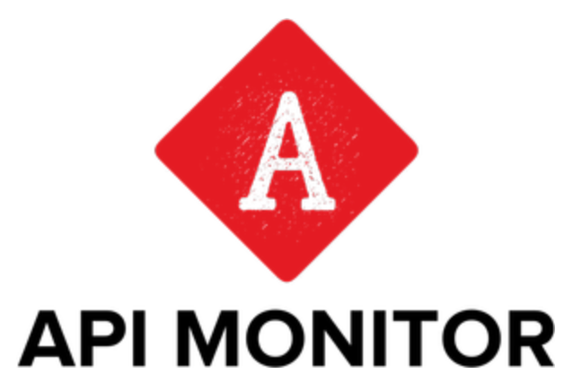

    

<h4> 
This is a CLI project that build with <a href="https://laravel-zero.com">Laravel Zero</a>
</h4>

Laravel Zero was created by, and is maintained by [Nuno Maduro](https://github.com/nunomaduro), and is a micro-framework that provides an elegant starting point for your console application. It is an **unofficial** and customized version of Laravel optimized for building command-line applications.

- Built on top of the [Laravel](https://laravel.com) components.
- Optional installation of Laravel [Eloquent](https://laravel-zero.com/docs/database/), Laravel [Logging](https://laravel-zero.com/docs/logging/) and many others.
- Supports interactive [menus](https://laravel-zero.com/docs/build-interactive-menus/) and [desktop notifications](https://laravel-zero.com/docs/send-desktop-notifications/) on Linux, Windows & MacOS.
- Ships with a [Scheduler](https://laravel-zero.com/docs/task-scheduling/) and  a [Standalone Compiler](https://laravel-zero.com/docs/build-a-standalone-application/).
- Integration with [Collision](https://github.com/nunomaduro/collision) - Beautiful error reporting

------

## Documentation

For full documentation, visit [laravel-zero.com](https://laravel-zero.com/).

## License

API Monitor is an open-source software licensed under the [MIT license](https://github.com/laravel-zero/laravel-zero/blob/stable/LICENSE.md).
