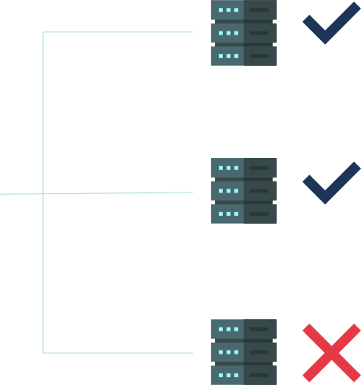

<p align="center">
</p>
<h3 align="center">API Monitor</h3>
<p align="center">A CLI program that help you check your endpoints by requesting the given servers and send a report message in any supported channel ( Telegram )</p>
<br>
<hr>


#### <center>This is a CLI project that build with <a href="https://laravel-zero.com">Laravel Zero</a></center>

### Features

* Check API endpoints status.
* Save the endpoints in sqlite database.
* Provide a bin command so you can execute via terminal or schedule the execution in crontab. 
* Send a report message to the supported channels ( Telegram ).

### Usage

* Clone this repo:

```bash
git clone https://github.com/husseinferas/api-monitor && cd  api-monitor
```

* Install the dependencies:
```bash
composer install
```

* Setup env and databases:
```bash
cp .env.example .env
```
* Edit `.env` file:
```dotenv
CONSUMER_KEY=[your-app-key]
DB_DATABASE=[your-sqlite-database-file-path]
DATA_SEED=[your-data-seed-file]

TELEGRAM_TOKEN=[your-telegram-token]
TELEGRAM_CHAT=[your-chat-id-which-chat-you-want-to-send]
```
* Setup data seed:

```bash
cp data.example.php .data.php
```
* Edit `data.php` and add your endpoints
```php
return [
    [
        'app' => 'app-name',
        'name' => 'endpoint-name',
        'url' => 'endpoint-url',
    ],
];
```

* Setup telegram channel:

  * Create a telegram bot and get your token using [BotFather](https://telegram.me/BotFather)
  * Add your telegram bot to channel or group where you what it to send the reports (it can send it to you directly)
  * Get the chat id using this command
``curl https://api.telegram.org/bot$[TELEGRAM_BOT_TOKEN]/getUpdates``

* Now you can test the application using this command:
```bash
php api-monitor check
```

**Note:** you can add this command to crontab and setup a schedule for monitoring. 


### Contributing

Pull requests are welcome. For major changes.

### License

API Monitor is an open-source software licensed under the [MIT license](https://github.com/husseinferas/api-monitor/blob/master/LICENSE).
